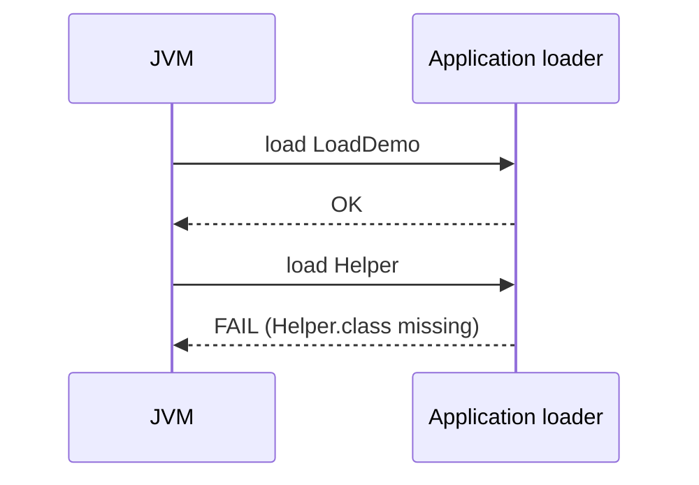
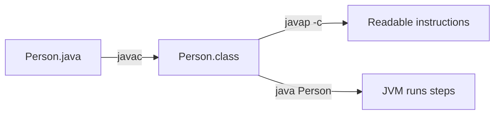

# Notes

## 1. Hello-world
Deleting source code doesn't prevent compiled byte-code from running.

## 2. Wora
source = human-readable code

byte-code = platform independent intermediate code

JVM = engine that executes the byte-code on different platforms

## 3. Control-flow
```
javap -c ControlFlow
Compiled from "ControlFlow.java"
public class ControlFlow {
public ControlFlow();
Code:
0: aload_0
1: invokespecial #1                  // Method java/lang/Object."<init>":()V
4: return

public static void main(java.lang.String[]);
Code:
0: iconst_4
1: istore_1
2: iload_1
3: iconst_2
4: irem
5: ifne          19
8: getstatic     #7                  // Field java/lang/System.out:Ljava/io/PrintStream;
11: ldc           #13                 // String even
13: invokevirtual #15                 // Method java/io/PrintStream.println:(Ljava/lang/String;)V
16: goto          27
19: getstatic     #7                  // Field java/lang/System.out:Ljava/io/PrintStream;
22: ldc           #21                 // String odd
24: invokevirtual #15                 // Method java/io/PrintStream.println:(Ljava/lang/String;)V
27: iconst_1
28: istore_2
29: iload_2
30: iconst_5
31: if_icmpgt     47
34: getstatic     #7                  // Field java/lang/System.out:Ljava/io/PrintStream;
37: iload_2
38: invokevirtual #23                 // Method java/io/PrintStream.println:(I)V
41: iinc          2, 1
44: goto          29
47: iconst_3
48: istore_2
49: iconst_3
50: istore_3
51: iload_3
52: iconst_1
53: if_icmplt     74
56: getstatic     #7                  // Field java/lang/System.out:Ljava/io/PrintStream;
59: iload_3
60: invokedynamic #26,  0             // InvokeDynamic #0:makeConcatWithConstants:(I)Ljava/lang/String;
65: invokevirtual #15                 // Method java/io/PrintStream.println:(Ljava/lang/String;)V
68: iinc          3, -1
71: goto          51
74: iconst_2
75: istore_3
76: iload_3
77: lookupswitch  { // 2
1: 104
2: 115
default: 126
}
104: getstatic     #7                  // Field java/lang/System.out:Ljava/io/PrintStream;
107: ldc           #30                 // String Monday
109: invokevirtual #15                 // Method java/io/PrintStream.println:(Ljava/lang/String;)V
112: goto          134
115: getstatic     #7                  // Field java/lang/System.out:Ljava/io/PrintStream;
118: ldc           #32                 // String Tuesday
120: invokevirtual #15                 // Method java/io/PrintStream.println:(Ljava/lang/String;)V
123: goto          134
126: getstatic     #7                  // Field java/lang/System.out:Ljava/io/PrintStream;
129: ldc           #34                 // String Other day
131: invokevirtual #15                 // Method java/io/PrintStream.println:(Ljava/lang/String;)V
134: return
}
```

## 4. Class-loading

Run Hello with -verbose:class and see which loader loaded it vs. a JDK class

Bootstrap loads core JDK classes; the Application loader loads your own classpath

```
java -verbose:class Hello 2>&1 | Select-String "Hello|String"


[0.016s][info][class,load] java.lang.String source: shared objects file
[0.017s][info][class,load] java.lang.AbstractStringBuilder source: shared objects file
[0.017s][info][class,load] java.lang.StringBuffer source: shared objects file
[0.017s][info][class,load] java.lang.StringBuilder source: shared objects file
[0.019s][info][class,load] java.lang.String$CaseInsensitiveComparator source: shared objects file
[0.019s][info][class,load] java.lang.StringLatin1 source: shared objects file
[0.023s][info][class,load] java.lang.StringConcatHelper source: shared objects file
[0.032s][info][class,load] java.lang.StringUTF16 source: shared objects file
[0.044s][info][class,load] java.lang.invoke.StringConcatFactory source: shared objects file
[0.044s][info][class,load] java.lang.StringCoding source: shared objects file
[0.047s][info][class,load] Hello source: file:/C:/Users/jp013/Work/Training/bc-sw-engineer-java-angular-participant/java-bootcamp/examples/module-01-exercises/
Hello, JVM!
```

| Line contains      | Loaded by                                     | Why       |
|--------------------|-----------------------------------------------|-----------|
| `java.lang.String` | Bootstrap (`jrt:/java.base` / shared objects) | Core JDK  |
| `Hello`            | Application (your folder path)                | Your code |

```
javac Helper.java LoadDemo.java

java LoadDemo
helper-ok

rm .\Helper.class

java LoadDemo
Exception in thread "main" java.lang.NoClassDefFoundError: Helper
        at LoadDemo.main(LoadDemo.java:4)
Caused by: java.lang.ClassNotFoundException: Helper
        at java.base/jdk.internal.loader.BuiltinClassLoader.loadClass(BuiltinClassLoader.java:641)
        at java.base/jdk.internal.loader.ClassLoaders$AppClassLoader.loadClass(ClassLoaders.java:188)
        at java.base/java.lang.ClassLoader.loadClass(ClassLoader.java:526)
        ... 1 more
```

Helper function failed to load in runtime



## 5. Variables

int/long/double/boolean/char/String, L suffix, quotes

String is a reference type (object), not a primitive

## 6. Methods

Static methods callable from static main without an object
Each call gets a stack frame

## 7. Objects
Person.java
### Stack and Heap Diagram
Class = blueprint; object = instance created with new

Fields live on the heap; the variable holding the reference lives on the stack

this.field = param in constructors

Enterprise context: A hospital Patient or warehouse Shipment object is the same pattern — identity fields on the heap, short-lived references in the request thread stack.

```

        STACK                         HEAP
   ┌─────────────┐              ┌──────────────────┐
   │   person    │ ───────────► │  Person object   │
   │ (reference) │              │  name = "Aman"   │
   └─────────────┘              │  age  = 21       │
                                └──────────────────┘
```
person stores a reference to the Person object in the heap.


## Javap


```
javap -c .\Person.class
Compiled from "Person.java"
public class Person {
  java.lang.String name;

  int age;

  public Person(java.lang.String, int);
    Code:
       0: aload_0
       1: invokespecial #1                  // Method java/lang/Object."<init>":()V
       4: aload_0
       5: aload_1
       6: putfield      #7                  // Field name:Ljava/lang/String;
       9: aload_0
      10: iload_2
      11: putfield      #13                 // Field age:I
      14: return

  public void display();
    Code:
       0: getstatic     #17                 // Field java/lang/System.out:Ljava/io/PrintStream;
       3: aload_0
       4: getfield      #7                  // Field name:Ljava/lang/String;
       7: aload_0
       8: getfield      #13                 // Field age:I
      11: invokedynamic #23,  0             // InvokeDynamic #0:makeConcatWithConstants:(Ljava/lang/String;I)Ljava/lang/String;
      16: invokevirtual #27                 // Method java/io/PrintStream.println:(Ljava/lang/String;)V
      19: return

  public static void main(java.lang.String[]);
    Code:
       0: new           #8                  // class Person
       3: dup
       4: ldc           #33                 // String Aman
       6: bipush        21
       8: invokespecial #35                 // Method "<init>":(Ljava/lang/String;I)V
      11: astore_1
      12: aload_1
      13: invokevirtual #38                 // Method display:()V
      16: return
}
```
### Three opcodes to remember

| Opcode              | Everyday meaning                               |
|---------------------|------------------------------------------------|
| `new`               | Create a new object                            |
| `ldc`               | Load a constant (e.g. `"Aman"`)                |
| `invokevirtual`     | Call an instance method (`display`, `println`) |
| `aload` / `aload_0` | Load an object reference (`this` / local)      |
| `return`            | Done                                           |

- `javac` produces instructions the JVM runs; `javap` only *shows* them
- How `new Person(...)` and `display()` look as bytecode chapters
- That you do **not** need to memorize every opcode — pattern recognition matters

**Enterprise context:** When a production jar “behaves oddly,” engineers sometimes `javap` a class to confirm what was actually shipped (wrong overload, missing method) without guessing from source alone.

### Big picture


